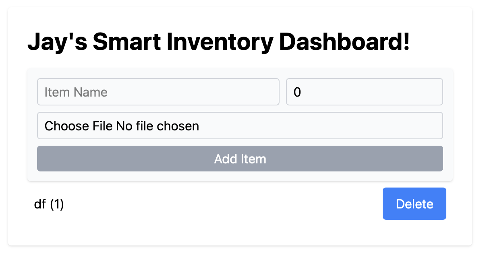

## Inventory AWS App

This project is a simple inventory management system using AWS DynamoDB, Lambda, S3, and React.
It supports adding, reading, and deleting inventory items, with optional file upload to S3 via Lambda.



## Features

#### Inventory Management

-   Add items with name and quantity
-   Delete items
-   List items dynamically
-   Upload optional file per item (stored in S3)

#### AWS Integration

-   **DynamoDB**: Stores inventory items
-   **Lambda**: Handles item creation (POST) and optional file upload
-   **S3**: Stores uploaded files

#### Frontend

-   React + TypeScript
-   Dynamic forms and inventory list rendering
-   Displays uploaded file names with clickable links to S3 objects

## Project Structure

```
inventory-aws/
├─ backend/
│  ├─ server.ts           # Express backend + Lambda routes
│  ├─ getItems.ts         # DynamoDB scan & parsing
│  ├─ lambda/
│  │  └─ addItemLambda.ts # Lambda function for adding items
│  ├─ s3Utils.ts          # S3 helpers
│  └─ createTable.ts      # DynamoDB table creation
├─ frontend/
│  ├─ src/
│  │  ├─ App.tsx
│  │  ├─ components/
│  │  │  ├─ InventoryList.tsx
│  │  │  └─ AddItemForm.tsx
│  └─ ...
├─ package.json
├─ tsconfig.json
└─ README.md
```

## How It Works (Technical Overview)

### Add Item Flow

1. User fills out `AddItemForm` in React.
2. Form submits `name`, `quantity`, and optional file (Base64-encoded) via POST to `/lambda/addItem`.
3. Backend triggers Lambda function (`addItemLambda.ts`):
    - If a file exists, Lambda uploads it to S3 using `s3Utils.ts`.
    - Item data (name, quantity, optional S3 file key) is stored in DynamoDB.
4. Frontend receives confirmation and refreshes inventory list.

### Fetch Items

-   Frontend calls `GET /items`.
-   Backend reads from DynamoDB (`getItems.ts`) and converts AWS attribute types (`{ S: "Apple" }`) to plain JSON.
-   Returns a list of items to React, which renders them in `InventoryList.tsx`.

### Delete Item

-   Frontend triggers `DELETE /items/:id`.
-   Backend removes the item from DynamoDB.
-   Optional: Delete the associated file from S3.

### AWS Services Interaction

-   DynamoDB: Stores inventory records (id, name, quantity, fileUrl).
-   S3: Stores uploaded files and generates public URLs.
-   Lambda: Handles POST requests, file processing, and writing to DynamoDB.
-   React Frontend: Provides dynamic forms and lists, communicates with backend API.

### AWS Services Interaction

-   **DynamoDB**: Stores inventory records (`id`, `name`, `quantity`, `fileName`/S3 key)
-   **S3**: Stores uploaded files, accessible via key/URL
-   **Lambda**: Handles POST requests, file processing, and writing to DynamoDB
-   **React Frontend**: Dynamic forms and list rendering, communicates with backend API

## Setup

#### Install dependencies

```bash
npm install
```

#### Start LocalStack

```bash
docker-compose up -d
```

LocalStack will emulate DynamoDB, Lambda, and S3.

#### Create DynamoDB Table

```bash
node backend/createTable.js
```

This will create a table named Inventory.

## Backend

#### Start backend server

```bash
node --loader ts-node/esm backend/server.js
```

## Frontend

#### Start frontend

```bash
npm run dev
```

#### Components

-   InventoryList.tsx – Fetches and displays inventory items from backend
-   AddItemForm.tsx – Form to add new items with optional file upload

## Feature Improvments

-   Add update/edit functionality
-   Add user authentication
-   Integrate with real AWS environment
-   Add pagination and search to inventory list
